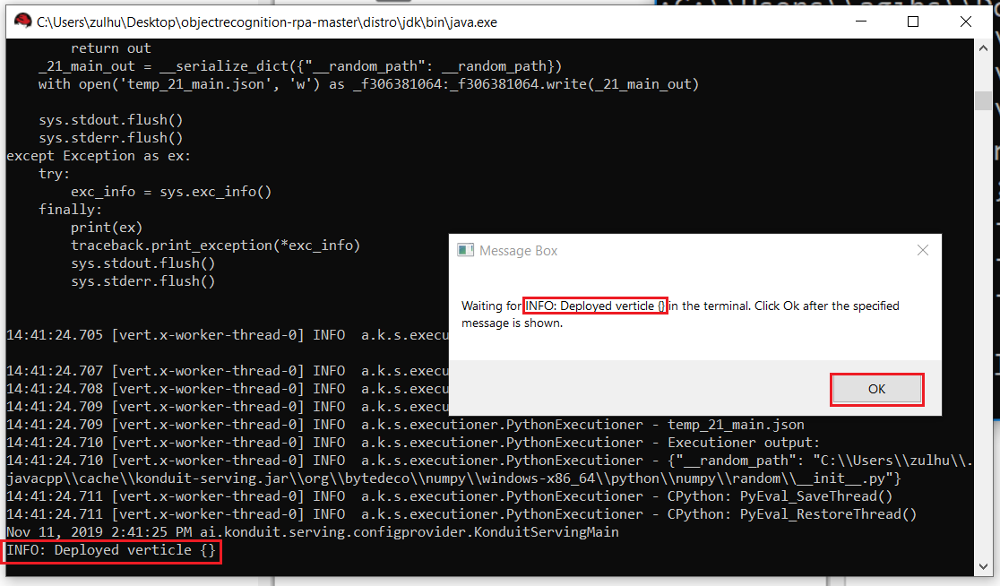

Workflows for Object Recognition
-----------------------------------
This workflow illustrates the integration of UiPath and Konduit-Serving with the example of object recognition. 
This workflow is able to recognize object in an image and give the name of the object based on Imagenet 1000 classes.  

File Descriptions
----------------------
**Main.xaml**: The main entry point. This contains the whole workflow for object recognition. It starts by initializing the server and the user will then input the image path that will be used for inference.

**StartServer.xaml**: This contains the workflow for starting the konduit serving server. This workflow can be used to be integrated in to a larger workflow.

**ScoreImage.xaml**: For use after the server is started. This allows you to send an image specified as a file path to 
the server for recognition. This workflow can be used to be integrated in to a larger workflow.

**DownloadAndExtract.xaml**: This automatically downloads and extracts a server where the
object recognition model will run

**ConfigureServer.xaml**: Handles configuring the server configuration (a json file) to point to your current directory
where you are running the workflow. This is necessary to start the server it (happens automatically)

Intended usage
------------------------------------
### Step 1: 
Run Main.xaml. This will download a server distribution from the releases
of this repository containing everything needed to run the model.
Note that the downloading of the server distribution takes about 30 minutes, depending on the network connection speed. 

After this, ensure the server output has "INFO: Deployed verticle {}" in the text and click "OK" on the popup window.

If there are any exceptions, please file a github issue.

### Step 2:
To test it, submit a test image by passing the path of the image into the popup window and click "OK".  
This is a workflow that contains an http request that handles calling the server via some configured parameters.

After this, a series of alerts will display indicating the output from the model and will also display an
image that was created that displays the labels found in the image along with the confidence level of the prediction.

The workflow will continue to prompt for image path in a loop. As long as new image path is provided, it will give predictions on the label of the images.
Once done, close the popup window to stop the workflow.

Integration usage
------------------------------

The json output from the model should be used and integrated in to a larger workflow
that takes action based on what object is present in the submitted picture.

 A workflow named ScoreImage.xaml is bundled
 with the server to invoke the server.

 You pass in an input image path and you can get output from the server. 

 

Afterwards, the workflow will output the coordinates and labels that are to be used in an external integration:

 

Troubleshooting
--------------------------------

If the download fails, follow the following steps:

1. Download the [zip file](https://github.com/KonduitAI/mailboxdetection-workflow/releases/download/v1.1/distro.zip)
containing the model and server. Extract it to *mailboxdetection-workflow* directory, which is the directory where your workflows are.

2. Run Main.xaml. This will invoke ConfigureServer.xml after checking that the zip file exists. The ConfigureServer.xml configure the server to start using the proper directory. This is required to start the server.
   
   

   The successful running of Main.xaml will start the server. 

If the ScoreImage.xaml fails to run the first time as intended above, this maybe due to a request time out due to the server
needing to startup the first time. Just rerun the workflow
and you should see the intended results.
